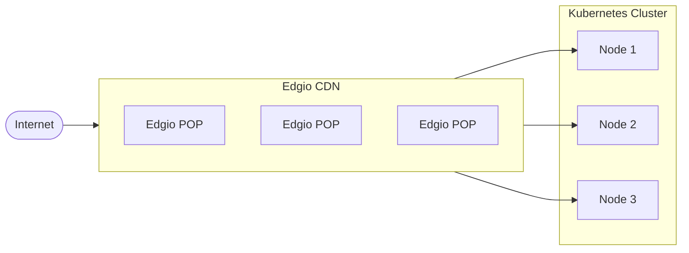

## Foreword


The following is an example of integrating Kubernetes with Edgio Delivery CDN service for experienced Kubernetes practitioners. It assumes a level of knowledge in Kubernetes and knowledge of standard internet protocols such as TCP, DNS, and HTTP/HTTPS. The final objective is to demonstrate a way to make Edgio Delivery CDN service appear as standard ingress. The Kubernetes user may maintain the ingress configuration in familiar systems such as [Portainer](https://www.portainer.io/) or [Terraform](https://www.terraform.io/).

## Kubernetes


Kubernetes.io defines Kubernetes as “an open-source system for automating deployment, scaling, and management of containerized applications.” There are several ways to bring up a cluster. The quickest and easiest way is to leverage one of the many cloud providers that allow “one-click” deployments.

Kubernetes clusters contain many parts. In the demo, we will focus on a subset of the total.

## Kubernetes Parts

- Node: machine or VM that hosts the workloads and services.
- Workload: Application simple or complex
- Pod: containers that the application software is running within. One or more pods make up a workload.
- Service: a mechanism that exposes a workload to other workloads or ingresses
- Ingress: A mechanism to expose services to the outside world

## Edgio


Edgio makes connected living faster, safer, and simpler to manage by powering unmatched speed, security and, simplicity at the edge with our seamlessly integrated delivery, applications and, streaming solutions. Our globally-scaled technology and expert services fuel the world’s top brands with the capacity to deliver the fastest, most dynamic and, frictionless education, entertainment, events and, applications to every user. Dedicated to providing unparalleled client care and extending value every step of the way, Edgio is a partner of choice, driving worldwide internet traffic to support the most popular shows, movies, sports, games and music, and instant-loading websites.

## Architecture





## Edgio Delivery CDN


For this demo, we use the Edgio python SDK at GitHub – llnw/llnw-sdk-python: Limelight Networks Python SDK. The basic configuration will be kept simple.

Configuring the CDN, the following pieces of data (other than authentication) are needed.

Shortname: A unique identifier within [Edgio Delivery CDN](https://edg.io/media/delivery/) that contains CDN rules.


Published hostname: The hostname that faces the Internet from the CDN. In the case of this demo, the hostname cstradtman.s.llnwi.net was previously configured.


Published Url Path: The path mapped into the specific rule in question.


Source Hostname: The hostname of the origin. In this case, a round-robin record points to the Kubernetes cluster.


Source Url Path: The destination path associated with the hostname. In this case, it will be blank since we describe it later in this document. In this demo, workloads will be differentiated by port number and not a path.

## DNS


The demo uses the Vultr DNS API. Configuring the CDN using IP addresses as the origins is not a best practice. The demo uses an API to create or modify a round-robin A record pointing to the cluster nodes.

## Cluster


The demo is in Vultr on a three-node cluster.

### Namespaces


The demo will exist under the default namespace since it’s the only thing running on this cluster

### Nodes

- VKE cluster – 3 nodes each with
- 4G ram
- 80G disk
- 2 vCPU
- 1 G network

### Workloads


The workload is a simple Python program that returns basic information about the HTTP connection. We deploy this demo inline, which is not a typical deployment method. However, it allows the demo to be fully self-contained rather than having external dependencies to build the containers and store them. The source code is in Appendix 1. The actual Python code is italicized, and the YAML code describing the deployment is not. The workload utilizes TCP port 8000.

### Services


There are several service types available. We are using the “NodePort” service type. It exposes the service on the external IP addresses of the cluster on a randomly selected high port number. Kubernetes takes care of the connection to a node where the workload runs.

### Ingress


Kubernetes ingress is a software object that describes the behavior of a collection of resources that make a Kubernetes service available outside of the cluster.

An Ingress controller combines software and/or hardware that instantiates the Ingress software object.

A CDN is a feature-rich distributed reverse proxy, besides the reverse proxy function, CDNs usually have flexible cache algorithms, geographic diversity, security features (ACLs (GEO, method, regex), Web applications Firewalls, watermarking, and other more advanced features not found in simple reverse proxies.

The APIs for Kubernetes object monitoring are well defined, and a number of HTTP reverse proxies and load balancers have been extended to work as Ingress controllers. For example, NGINX and HAProxy are old school proxies that have been extended to work as ingress controllers and ones like Traefik and Itsio were developed in parallel to Kubernetes . A CDN is a natural next progression from simple reverse proxies. In the case of this demo, we will create a custom ingress controller that controls Edgio Delivery CDN. The data typically required for describing an Ingress is


- Public Hostname: The hostname that the Kubernetes service will be available on
- Public path: the path associated with the Public hostname that the Kubernetes services will be available on
- Backend service name: service-name defined by a Kubernetes services stanza
- Backend Port: A name matching the port description in the service description


Edgio Delivery CDN asset mappings:


| Kubernetes | Edgio Delivery CDN |
| --- | --- |
| Public Hostname | Published Hostname |
| Public Path | Published URL Path |
| Backend Service Name | Unique within the Kubernetes cluster (Not known/available to the outside world) |
| Source Hostname | Fully qualified domain name (Not actually one-to-one) |


The logic behind it is:


- Listen for namespace ingress event from the cluster

- If the event type is “added.”

- Get the IP address of nodes in the cluster
- Create DNS record in vultr
- Create CDN rules in Edgio CDN pointing toward the created DNS records and the port allocated by the NodePort service.

- If the event type is “modified.”

- Find CDN rules in Edgio CDN that match the existing ingress
- Modify rules in Edgio CDN to reflect new data in the event

- If the event type is “deleted.”

- Find CDN rules in Edgio CDN that match removed ingress
- Remove DNS records in Vultr associated with this ingress
- Remove the CDN rules in Edgio that match removed ingress

## Configuration

### Objects


Kubernetes objects are described in [YAML](https://yaml.org/) files. In Kubernetes, every configuration is an object. You could place all the deployment configs in a single file. It’s common practice to break them up based on what portion of the deployment they describe.

### Deployment


In Appendix 1, there is a large YAML file that is a combination of Python code and YAML. Everything after “spec.template.spec.containers.command” is the Python code that is turned into a container during the deployment. From the point of view of the Kubernetes object the lines that are important to us for the demo are:


- Kind: Deployment – describes the object as a deployment
- Metadata.name: name is used by the service object to create the link between the two.
- Spec.selector.matchlabels.app: tells what pods the deployment will apply to.
- Spec.template.spec.containers.image: points to the docker hub python 3 official image
- Spec.template.spec.containers.ports.name: a label for the port to be referenced in other objects service in this case
- Spec.template.spec.containers.ports.containerport: lists the TCP port exposed from the running container

### Service

- Kind: Deployment – describes the object as a deployment
- Metadata.name: name is used by the ingress object to create the link between the two.
- Spec.selector.app: points to the name of the deployment – pywai-inline-service as named in the deployment object.
- Spec.selector.type: Nodeport this defines this service as type Nodeport as described above
- Spec.ports.name: the label for the port to be referenced by other objects(ingress in this case)
- Spec.ports.protocol: defines IP protocol in use – TCP
- Spec.ports.port: defines port exposed by this service
- spec.ports.targetPort: points to port exposed by the deployment – pywai-inline-deployment in this case

### Ingress


In Appendix 3, you will see the YAML file describing the Kubernetes object for the Edgio ingress controller. The objects to be concerned with are:


- Kind: Ingress – this tells Kubernetes that it is an Ingress object
- Medatdata.name – everything in Kubernetes must have a name
- Metadata.labels.cdn – this tag is used to signal the ingress controller that this object is for the edgio ingress controller
- Spec.rules.host – public hostname to expose the service.
- Spec.rules.http.paths.path – path associated with the service.
- Spec.rules.http.paths.backend.service.name – label of the service to expose
- Spec.rules.http.paths.backend.service.port.name – label of port of the service to expose

### Config Maps

#### Secrets


Kubernetes has a built-in concept of secrets for the storage of sensitive data. This demo leverages this for the usernames and shared keys for both Edgio SDK and the Vultr DNS API

### Code examples


The code for this demonstration included in the git repos


- Edgio Delivery python SDK

- <https://github.com/llnw/llnw-sdk-python>

- Kubernetes demo deployment

- <https://github.com/llnw/edgio-delivery-k8s-demo>
- These are a series of Kubernetes object described as yaml that show how to deploy the Edgio Delivery integration

- Edgio Delivery ingress controller demo

- <https://github.com/llnw/edgio-delivery-k8s-ingress-demo>
- This is the actual code that implements the Edgio Delivery ingress controller
- In the long run it should be run as a service within Kubernetes, however to keep the demo simple it simply runs as a separate process

### Future additions and enhancements to the current design

In a future post, we’ll show how to leverage other Edgio solutions for example Applications. We could use the Kubernetes cluster as a way to leverage and sync configurations among multiple Edgio CDN offerings for different workflows.

```yaml
apiVersion: apps/v1
kind: Deployment
metadata:
name: pywai-inline-deployment
spec:
  selector:
    matchLabels:
      app: pywai-inline-deployment
  replicas: 1
  template:
    metadata:
      labels:
        app: pywai-inline-deployment
    spec:
      containers:
        - name: python
          image: python:3
          command:
            - /bin/sh
            - "-c"
            - |
              cat > /test.py <<EOF
              #!/usr/bin/env python3
              """
              Very simple HTTP server in python for logging requests
              Usage::
                  ./server.py [<port>]
              """
              from http.server import BaseHTTPRequestHandler, HTTPServer
              import logging
              import pprint

              class S(BaseHTTPRequestHandler):
                  def _set_response(self):
                      self.send_response(200)
                      self.send_header('Content-type', 'text/html')
                      self.end_headers()

                  def do_GET(self):
                      logging.info("GET request,\nPath: %s\nHeaders:\n%s\n", str(self.path), str(pprint.pformat(self.headers)))
                      self._set_response()
                      headerinfo = pprint.pformat(self.headers.items())
                      clientinfo = pprint.pformat(self.client_address)
                      lineinfo = pprint.pformat(self.requestline)
                      versioninfo = pprint.pformat(self.request_version)

                      self.wfile.write("<pre> {} </pre>".format(headerinfo).encode('utf-8'))
                      self.wfile.write("<pre> {} </pre>".format(clientinfo).encode('utf-8'))
                      self.wfile.write("<pre> {} </pre>".format(lineinfo).encode('utf-8'))
                      self.wfile.write("<pre> {} </pre>".format(versioninfo).encode('utf-8'))

              def run(server_class=HTTPServer, handler_class=S, port=8080):
                  logging.basicConfig(level=logging.INFO)
                  server_address = ('', port)
                  httpd = server_class(server_address, handler_class)
                  logging.info('Starting httpd...\n')
                  try:
                      httpd.serve_forever()
                  except KeyboardInterrupt:
                      pass
                  httpd.server_close()
                  logging.info('Stopping httpd...\n')

              if __name__ == '__main__':
                  from sys import argv
                  if len(argv) == 2:
                      run(port=int(argv[1]))
                  else:
                      run()
              EOF
              exec python /test.py 8000
          ports:
            - name: http
              containerPort: 8000
```

### Appendix 2 – pywai-inline-service.yaml


apiVersion: v1

kind: Service

metadata:

name: pywai-inline-service

spec:

selector:

app: pywai-inline-deployment

type: NodePort

ports:

- name: http

protocol: TCP

port: 80

targetPort: 8000

## Appendix 3 – pywai-edgio-ingress.yaml

apiVersion: networking.k8s.io/v1
kind: Ingress
metadata:
name: external-pywai-inline-ingress
annotations:
kubernetes.io/ingress.class: edgio
labels:
cdn: edgio
spec:
rules:
- host: <Enter unique shortname>.s.llnwi.net
http:
paths:
- path: /fred
pathType: Exact
backend:
service:
name: external-pywai-inline-service
port:
name: pywai-port
